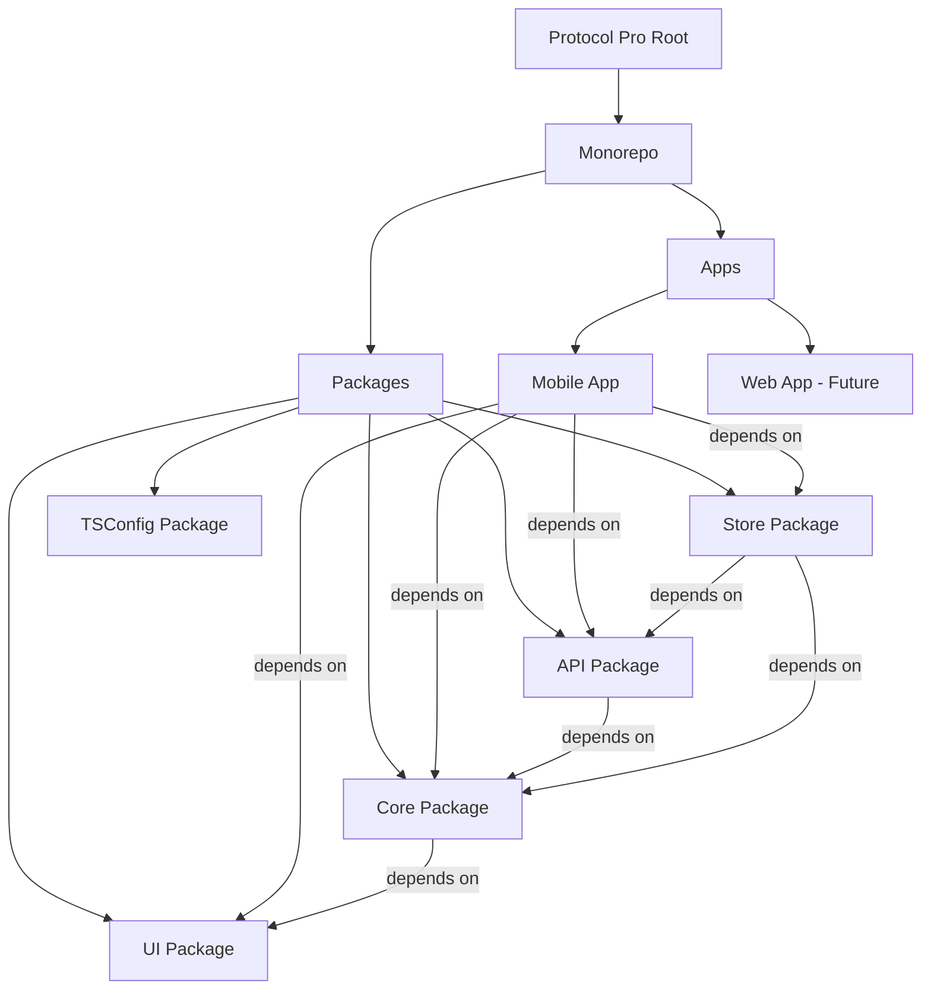
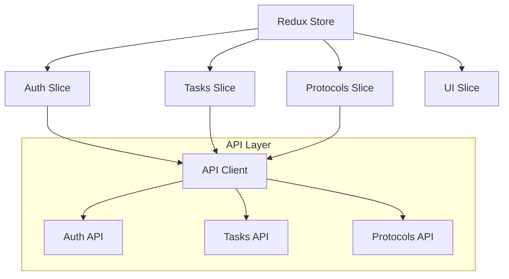
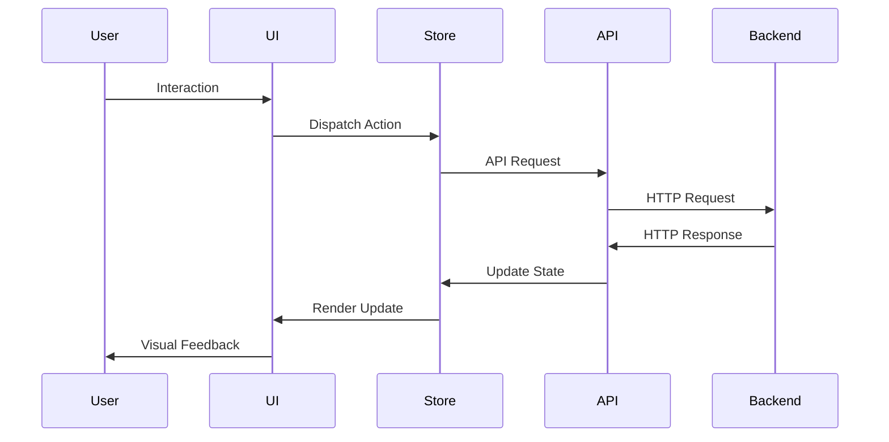

# Protocol Pro Architecture

This document provides a detailed overview of the Protocol Pro architecture.

## Monorepo Structure

Protocol Pro uses a monorepo architecture to manage multiple packages and applications within a single repository.



## Package Dependencies

- **Mobile App**: Depends on UI, Core, API, and Store packages
- **UI Package**: Standalone UI components
- **Core Package**: Depends on UI package
- **API Package**: Depends on Core package
- **Store Package**: Depends on API and Core packages

## State Management

Protocol Pro uses Redux for state management with the following structure:



## Data Flow



## Technology Stack

- **React Native**: Mobile app framework
- **Expo**: React Native toolchain
- **Redux**: State management with Redux Toolkit
- **React Redux**: React bindings for Redux
- **Redux Persist**: Persist and rehydrate Redux store
- **React Native Reusables**: Reusable components for React Native
- **ShadCN UI**: Styling approach for consistent UI components
- **Turborepo**: Monorepo build system

## Additional Architecture Documentation

- [Monorepo Structure](./monorepo-structure.md)
- [Data Flow](./data-flow.md)
- [State Management](./state-management.md)
- [Navigation](./navigation.md)
- [Tech Stack](./tech-stack.md)
- [App Flow](./app-flow.md)
```

### docs/development/best-practices.md

```markdown
# Development Best Practices

This document outlines the best practices for development in the Protocol Pro project.

## Code Quality

- **Linting**: All code must pass ESLint checks before being committed
- **Type Safety**: Use TypeScript for all new code
- **Function Length**: Keep functions under 50 lines
- **Comments**: Every function must have a descriptive comment explaining its purpose
- **Testing**: Write tests for all new functionality

## AI-Assisted Development

When working with AI tools like GitHub Copilot or Claude:

- **Review All Generated Code**: Always review and understand AI-generated code before using it
- **Ownership**: You are responsible for any AI-generated code you commit
- **Testing**: Thoroughly test AI-generated code as it may contain subtle bugs
- **Refactoring**: Refactor AI-generated code to match project style and best practices

## Git Workflow

- **Branch Naming**: Use descriptive branch names (e.g., `feature/add-login`, `bugfix/fix-navigation`)
- **Commit Messages**: Write clear, descriptive commit messages
- **Pull Requests**: Include a description, screenshots (if applicable), and testing instructions
- **Code Reviews**: All code must be reviewed by at least one other developer
- **Diagrams**: Include Mermaid diagrams in PRs for significant architectural changes

## Documentation

- **Update Documentation**: Keep documentation up-to-date with code changes
- **README Files**: Each package should have a README.md file explaining its purpose and usage
- **API Documentation**: Document all public APIs and components
- **Architecture Documentation**: Update architecture diagrams when making significant changes

## Performance

- **Bundle Size**: Be mindful of adding large dependencies
- **Rendering Performance**: Use React's performance tools to identify and fix performance issues
- **Memory Management**: Avoid memory leaks by cleaning up resources (e.g., event listeners, subscriptions)

## Accessibility

- **Semantic HTML**: Use semantic HTML elements
- **Keyboard Navigation**: Ensure all interactive elements are keyboard accessible
- **Screen Readers**: Test with screen readers to ensure compatibility
- **Color Contrast**: Maintain sufficient color contrast for text and interactive elements

## Security

- **Input Validation**: Validate all user input
- **Authentication**: Follow secure authentication practices
- **Data Storage**: Be careful with sensitive data storage
- **Dependencies**: Regularly update dependencies to address security vulnerabilities
```

### docs/product/prd.md (Migrated from instructions/PRD.md)

```markdown
# Protocol Pro Product Requirements Document

## Overview

Protocol Pro is a mobile application designed to help instructors create and share protocols with followers. The app allows instructors to create step-by-step protocols, assign them to followers, and track progress. Followers can view assigned protocols, mark steps as complete, and provide feedback.

## User Personas

### Instructor
- Creates and manages protocols
- Assigns protocols to followers
- Tracks follower progress
- Provides feedback and guidance

### Follower
- Views assigned protocols
- Completes protocol steps
- Provides feedback on protocols
- Tracks personal progress

## Features

### Authentication
- User registration and login
- Profile management
- Role-based access control (Instructor/Follower)

### Protocol Management (Instructor)
- Create new protocols
- Edit existing protocols
- Add steps to protocols
- Assign protocols to followers
- Track follower progress
- Provide feedback on follower progress

### Protocol Execution (Follower)
- View assigned protocols
- View protocol steps
- Mark steps as complete
- Provide feedback on protocols
- Track personal progress

### Notifications
- Protocol assignment notifications
- Progress update notifications
- Feedback notifications

### Analytics
- Protocol completion rates
- Step completion times
- Follower progress tracking
- Instructor effectiveness metrics

## User Flows

### Instructor Flow
1. Login to the app
2. Create a new protocol
3. Add steps to the protocol
4. Assign the protocol to followers
5. Track follower progress
6. Provide feedback on follower progress

### Follower Flow
1. Login to the app
2. View assigned protocols
3. Select a protocol to execute
4. View protocol steps
5. Mark steps as complete
6. Provide feedback on the protocol

## Technical Requirements

- React Native mobile application
- Redux for state management
- API integration for data persistence
- Offline support for protocol execution
- Push notifications for updates
- Analytics tracking

## Success Metrics

- Number of active instructors
- Number of active followers
- Number of protocols created
- Protocol completion rate
- User retention rate
- User satisfaction score

## Timeline

- **Phase 1**: Authentication, basic protocol management, and execution
- **Phase 2**: Notifications, feedback, and basic analytics
- **Phase 3**: Advanced analytics, offline support, and performance optimizations
```

## Phase 4: Update Package Documentation

### monorepo/README.md (Updated)

```markdown
# Protocol Pro Monorepo

This is a monorepo for the Protocol Pro application, built with React Native, Redux, and custom UI components.

## Structure

The monorepo is organized into the following packages:

- `apps/mobile`: The main React Native Expo app
- `packages/ui`: Shared UI components using ShadCN styling
- `packages/core`: Shared business logic and utilities
- `packages/api`: API client and data fetching logic
- `packages/store`: Redux store, slices, and actions

## Technologies

- **React Native**: Mobile app framework
- **Expo**: React Native toolchain
- **Redux**: State management with Redux Toolkit
- **React Redux**: React bindings for Redux
- **Redux Persist**: Persist and rehydrate Redux store
- **React Native Reusables**: Reusable components for React Native
- **ShadCN UI**: Styling approach for consistent UI components
- **Turborepo**: Monorepo build system

## Getting Started

### Prerequisites

- Node.js 18 or higher
- npm 10 or higher

### Installation

1. Clone the repository
2. Install dependencies:

```bash
# Install root dependencies
npm install

# Install all workspace dependencies
npm run install:all
```

### Development

To start the development server:

```bash
# Start the mobile app
npm run mobile
```

### Building

To build all packages:

```bash
npm run build
```

## Troubleshooting

If you encounter issues with dependencies, try the following:

1. Clear npm cache:
```bash
npm cache clean --force
```

2. Remove node_modules and reinstall:
```bash
rm -rf node_modules
rm -rf */*/node_modules
npm run install:all
```

3. If you have issues with the mobile app, try:
```bash
cd apps/mobile
npx expo doctor
```

## Package Details

### UI Package

The UI package contains reusable UI components styled with ShadCN approach:

- Button
- Card
- Input
- Text
- ProgressBar

### Store Package

The store package contains Redux store configuration and slices:

- Auth slice
- Tasks slice
- Protocols slice
- UI slice

### Core Package

The core package contains shared business logic and utilities.

### API Package

The API package contains API client and data fetching logic.

## Documentation

For comprehensive documentation, please refer to the [docs](../docs) directory in the root of the repository.

## License

MIT
```

### y/README.md (Updated)

```markdown
# Turborepo Starter

This Turborepo starter is maintained by the Turborepo core team and serves as a reference implementation for monorepo architecture.

## Purpose

This directory contains a standard Turborepo setup that can be used as:

1. A reference for monorepo best practices
2. A starting point for new monorepo projects
3. A comparison point for the Protocol Pro monorepo implementation

## Using this Example

Run the following command to create a new Turborepo project:

```sh
npx create-turbo@latest
```

## What's inside?

This Turborepo includes the following packages/apps:

### Apps and Packages

- `docs`: a [Next.js](https://nextjs.org/) app
- `web`: another [Next.js](https://nextjs.org/) app
- `@repo/ui`: a stub React component library shared by both `web` and `docs` applications
- `@repo/eslint-config`: `eslint` configurations (includes `eslint-config-next` and `eslint-config-prettier`)
- `@repo/typescript-config`: `tsconfig.json`s used throughout the monorepo

Each package/app is 100% [TypeScript](https://www.typescriptlang.org/).

### Utilities

This Turborepo has some additional tools already setup for you:

- [TypeScript](https://www.typescriptlang.org/) for static type checking
- [ESLint](https://eslint.org/) for code linting
- [Prettier](https://prettier.io) for code formatting

### Build

To build all apps and packages, run the following command:

```
cd y
npm run build
```

### Develop

To develop all apps and packages, run the following command:

```
cd y
npm run dev
```

### Remote Caching

> [!TIP]
> Vercel Remote Cache is free for all plans. Get started today at [vercel.com](https://vercel.com/signup?/signup?utm_source=remote-cache-sdk&utm_campaign=free_remote_cache).

Turborepo can use a technique known as [Remote Caching](https://turbo.build/repo/docs/core-concepts/remote-caching) to share cache artifacts across machines, enabling you to share build caches with your team and CI/CD pipelines.

By default, Turborepo will cache locally. To enable Remote Caching you will need an account with Vercel. If you don't have an account you can [create one](https://vercel.com/signup?utm_source=turborepo-examples), then enter the following commands:

```
cd y
npx turbo login
```

This will authenticate the Turborepo CLI with your [Vercel account](https://vercel.com/docs/concepts/personal-accounts/overview).

Next, you can link your Turborepo to your Remote Cache by running the following command from the root of your Turborepo:

```
npx turbo link
```

## Relationship to Protocol Pro

The Protocol Pro application in the `monorepo` directory uses similar monorepo principles but is specifically tailored for the Protocol Pro application. This directory serves as a reference implementation that can be compared with the Protocol Pro monorepo.

## Useful Links

Learn more about the power of Turborepo:

- [Tasks](https://turbo.build/repo/docs/core-concepts/monorepos/running-tasks)
- [Caching](https://turbo.build/repo/docs/core-concepts/caching)
- [Remote Caching](https://turbo.build/repo/docs/core-concepts/remote-caching)
- [Filtering](https://turbo.build/repo/docs/core-concepts/monorepos/filtering)
- [Configuration Options](https://turbo.build/repo/docs/reference/configuration)
- [CLI Usage](https://turbo.build/repo/docs/reference/command-line-reference)
```

## Phase 5: Create Package-Specific Documentation

### monorepo/packages/ui/README.md

```markdown
# UI Package

The UI package contains reusable UI components styled with the ShadCN approach.

## Overview

This package provides a set of reusable UI components that follow the ShadCN styling approach. These components are used throughout the Protocol Pro application to maintain a consistent look and feel.

## Installation

```bash
cd packages/ui
npm install
```

## Usage

Import components from the UI package:

```tsx
import { Button, Card, Input, Text, ProgressBar } from '@repo/ui';

function MyComponent() {
  return (
    <Card>
      <Text>Hello, world!</Text>
      <Input placeholder="Enter your name" />
      <ProgressBar value={50} />
      <Button>Submit</Button>
    </Card>
  );
}
```

## Components

### Button

A customizable button component.

```tsx
<Button variant="primary" size="md" onClick={() => console.log('Clicked!')}>
  Click me
</Button>
```

### Card

A container component with styling.

```tsx
<Card padding="md" shadow>
  <Text>Card content</Text>
</Card>
```

### Input

A text input component.

```tsx
<Input 
  placeholder="Enter text" 
  value={value} 
  onChange={(e) => setValue(e.target.value)} 
/>
```

### Text

A text component with styling options.

```tsx
<Text size="md" weight="bold" color="primary">
  Hello, world!
</Text>
```

### ProgressBar

A progress bar component.

```tsx
<ProgressBar value={75} max={100} showLabel />
```

## Development

### Adding a new component

1. Create a new file in the `src/components` directory
2. Implement the component with TypeScript and ShadCN styling
3. Export the component from the package
4. Add tests for the component
5. Add documentation for the component

### Testing

```bash
npm run test
```

### Building

```bash
npm run build
```

## Documentation

For detailed documentation on UI components, please refer to the [UI documentation](../../docs/ui) in the root docs directory.
```

### monorepo/packages/core/README.md

```markdown
# Core Package

The Core package contains shared business logic and utilities used throughout the Protocol Pro application.

## Overview

This package provides core business logic, utilities, and types that are used across the Protocol Pro application. It encapsulates common functionality to ensure consistency and reduce duplication.

## Installation

```bash
cd packages/core
npm install
```

## Usage

Import utilities and types from the Core package:

```tsx
import { formatDate, calculateProgress, type Protocol, type User } from '@repo/core';

const date = formatDate(new Date());
const progress = calculateProgress(completedSteps, totalSteps);
```

## Features

### Date Utilities

Functions for formatting and manipulating dates.

```tsx
import { formatDate, dateToISOString, addDays } from '@repo/core';

const formattedDate = formatDate(new Date()); // "May 15, 2023"
const isoDate = dateToISOString(new Date()); // "2023-05-15T12:00:00.000Z"
const futureDate = addDays(new Date(), 7); // Date 7 days in the future
```

### Math Utilities

Functions for mathematical operations.

```tsx
import { calculatePercentage, clamp } from '@repo/core';

const percentage = calculatePercentage(75, 100); // 75
const clampedValue = clamp(value, 0, 100); // Value between 0 and 100
```

### Types

TypeScript types used throughout the application.

```tsx
import { 
  type Protocol, 
  type ProtocolStep, 
  type User, 
  type Auth 
} from '@repo/core';

const protocol: Protocol = {
  id: '1',
  title: 'My Protocol',
  steps: [],
  createdAt: new Date(),
  updatedAt: new Date()
};
```

### Validation

Functions for validating data.

```tsx
import { validateEmail, validatePassword } from '@repo/core';

const isEmailValid = validateEmail(email); // true or false
const isPasswordValid = validatePassword(password); // true or false
```

## Development

### Adding new utilities

1. Create a new file in the appropriate directory
2. Implement the utility with TypeScript
3. Export the utility from the package
4. Add tests for the utility
5. Add documentation for the utility

### Testing

```bash
npm run test
```

### Building

```bash
npm run build
```

## Documentation

For detailed documentation on Core functionality, please refer to the [Core documentation](../../docs/core) in the root docs directory.
```

### monorepo/packages/api/README.md

```markdown
# API Package

The API package contains API client and data fetching logic for the Protocol Pro application.

## Overview

This package provides a client for interacting with the Protocol Pro API, including authentication, data fetching, and error handling. It abstracts away the details of API communication and provides a clean interface for the rest of the application.

## Installation

```bash
cd packages/api
npm install
```

## Usage

Import API client and hooks from the API package:

```tsx
import { api, useQuery, useMutation } from '@repo/api';

// Using the API client directly
api.getProtocols().then(protocols => {
  console.log(protocols);
});

// Using hooks in a React component
function ProtocolList() {
  const { data, isLoading, error } = useQuery('protocols', api.getProtocols);
  
  if (isLoading) return <Loading />;
  if (error) return <Error error={error} />;
  
  return (
    <List>
      {data.map(protocol => (
        <ListItem key={protocol.id}>{protocol.title}</ListItem>
      ))}
    </List>
  );
}
```

## Features

### API Client

The API client provides methods for interacting with the API:

```tsx
import { api } from '@repo/api';

// Authentication
await api.login(email, password);
await api.register(email, password, name);
await api.logout();

// Protocols
const protocols = await api.getProtocols();
const protocol = await api.getProtocol(id);
await api.createProtocol(protocol);
await api.updateProtocol(id, protocol);
await api.deleteProtocol(id);

// Users
const users = await api.getUsers();
const user = await api.getUser(id);
await api.updateUser(id, user);
```

### React Hooks

The API package provides React hooks for data fetching:

```tsx
import { useQuery, useMutation } from '@repo/api';

// Query hook
function ProtocolDetails({ id }) {
  const { data, isLoading, error } = useQuery(
    ['protocol', id], 
    () => api.getProtocol(id)
  );
  
  // ...
}

// Mutation hook
function CreateProtocol() {
  const mutation = useMutation(
    (protocol) => api.createProtocol(protocol),
    {
      onSuccess: () => {
        // Handle success
      },
      onError: (error) => {
        // Handle error
      }
    }
  );
  
  const handleSubmit = (protocol) => {
    mutation.mutate(protocol);
  };
  
  // ...
}
```

### Error Handling

The API package includes error handling utilities:

```tsx
import { ApiError, isApiError } from '@repo/api';

try {
  await api.getProtocol(id);
} catch (error) {
  if (isApiError(error)) {
    console.error(`API Error: ${error.message}, Status: ${error.status}`);
  } else {
    console.error(`Unknown error: ${error.message}`);
  }
}
```

## Development

### Adding new API methods

1. Add the method to the API client
2. Add tests for the method
3. Update documentation

### Testing

```bash
npm run test
```

### Building

```bash
npm run build
```

## Documentation

For detailed documentation on the API package, please refer to the [API documentation](../../docs/api) in the root docs directory.
```

### monorepo/packages/store/README.md

```markdown
# Store Package

The Store package contains Redux store configuration and slices for the Protocol Pro application.

## Overview

This package provides a centralized state management solution using Redux Toolkit. It includes store configuration, slices for different domains, and selectors for accessing state.

## Installation

```bash
cd packages/store
npm install
```

## Usage

Import store and hooks from the Store package:

```tsx
import { store, useAppDispatch, useAppSelector } from '@repo/store';
import { selectUser, login, logout } from '@repo/store/slices/auth';

// Using the store directly
store.dispatch(login({ email, password }));

// Using hooks in a React component
function UserProfile() {
  const dispatch = useAppDispatch();
  const user = useAppSelector(selectUser);
  
  const handleLogout = () => {
    dispatch(logout());
  };
  
  return (
    <div>
      <h1>{user.name}</h1>
      <button onClick={handleLogout}>Logout</button>
    </div>
  );
}
```

## Features

### Store Configuration

The store is configured with Redux Toolkit and includes the following features:

- Redux Toolkit for simplified Redux usage
- Redux Persist for state persistence
- Redux Thunk for async actions
- Development tools integration

### Slices

The store is divided into slices for different domains:

#### Auth Slice

Manages authentication state:

```tsx
import { login, logout, selectUser, selectIsAuthenticated } from '@repo/store/slices/auth';

// Dispatch actions
dispatch(login({ email, password }));
dispatch(logout());

// Select state
const user = useAppSelector(selectUser);
const isAuthenticated = useAppSelector(selectIsAuthenticated);
```

#### Protocols Slice

Manages protocols state:

```tsx
import { 
  fetchProtocols, 
  createProtocol, 
  updateProtocol, 
  deleteProtocol,
  selectProtocols,
  selectProtocolById
} from '@repo/store/slices/protocols';

// Dispatch actions
dispatch(fetchProtocols());
dispatch(createProtocol(protocol));
dispatch(updateProtocol({ id, protocol }));
dispatch(deleteProtocol(id));

// Select state
const protocols = useAppSelector(selectProtocols);
const protocol = useAppSelector(state => selectProtocolById(state, id));
```

#### Tasks Slice

Manages tasks state:

```tsx
import { 
  fetchTasks, 
  createTask, 
  updateTask, 
  deleteTask,
  selectTasks,
  selectTaskById
} from '@repo/store/slices/tasks';

// Dispatch actions
dispatch(fetchTasks());
dispatch(createTask(task));
dispatch(updateTask({ id, task }));
dispatch(deleteTask(id));

// Select state
const tasks = useAppSelector(selectTasks);
const task = useAppSelector(state => selectTaskById(state, id));
```

#### UI Slice

Manages UI state:

```tsx
import { 
  showModal, 
  hideModal, 
  setLoading, 
  setError,
  selectModalState,
  selectLoading,
  selectError
} from '@repo/store/slices/ui';

// Dispatch actions
dispatch(showModal({ id: 'create-protocol', data: { title: 'New Protocol' } }));
dispatch(hideModal());
dispatch(setLoading(true));
dispatch(setError('An error occurred'));

// Select state
const modalState = useAppSelector(selectModalState);
const loading = useAppSelector(selectLoading);
const error = useAppSelector(selectError);
```

### Hooks

Custom hooks for working with the store:

```tsx
import { useAppDispatch, useAppSelector } from '@repo/store';

function MyComponent() {
  const dispatch = useAppDispatch();
  const user = useAppSelector(selectUser);
  
  // ...
}
```

## Development

### Adding a new slice

1. Create a new file in the `src/slices` directory
2. Implement the slice using Redux Toolkit's `createSlice`
3. Export the slice reducer, actions, and selectors
4. Add the slice to the root reducer

### Testing

```bash
npm run test
```

### Building

```bash
npm run build
```

## Documentation

For detailed documentation on the Store package, please refer to the [Store documentation](../../docs/store) in the root docs directory.
```

### monorepo/apps/mobile/README.md

```markdown
# Protocol Pro Mobile App

The Protocol Pro mobile app is a React Native Expo application for instructors and followers.

## Overview

This app allows instructors to create and share protocols with followers. Followers can view assigned protocols, mark steps as complete, and provide feedback.

## Features

- User authentication (login, registration, profile management)
- Protocol creation and management (for instructors)
- Protocol execution (for followers)
- Progress tracking
- Notifications
- Offline support

## Getting Started

### Prerequisites

- Node.js 18 or higher
- npm 10 or higher
- Expo CLI (optional, but recommended)

### Installation

```bash
# Install dependencies
npm install
```

### Development

```bash
# Start the Expo development server
npm run start

# Start iOS simulator
npm run ios

# Start Android emulator
npm run android

# Start web version
npm run web
```

## Project Structure

```
mobile/
├── src/
│   ├── components/       # Shared components
│   ├── screens/          # Screen components
│   ├── navigation/       # Navigation configuration
│   ├── hooks/            # Custom React hooks
│   ├── services/         # Service integrations
│   ├── utils/            # Utility functions
│   ├── types/            # TypeScript type definitions
│   ├── theme/            # Theming configuration
│   └── i18n/             # Internationalization
└── assets/               # Static assets
```

## Dependencies

The mobile app depends on the following packages:

- `@repo/ui`: UI components
- `@repo/core`: Core business logic and utilities
- `@repo/api`: API client and data fetching
- `@repo/store`: Redux store configuration and slices

## Development Guidelines

### Code Style

- Follow the project's ESLint and Prettier configuration
- Use TypeScript for all new code
- Keep functions under 50 lines
- Add comments to functions
- Test all new functionality

### Testing

```bash
# Run tests
npm run test

# Run tests with coverage
npm run test:coverage
```

### Building

```bash
# Build for production
npm run build
```

## Troubleshooting

If you encounter issues:

1. Check that all dependencies are installed:
```bash
npm install
```

2. Clear the Metro bundler cache:
```bash
npx expo start -c
```

3. Run the Expo doctor:
```bash
npx expo doctor
```

## Documentation

For comprehensive documentation, please refer to the [docs](../../../docs) directory in the root of the repository.
```

## Phase 6: Migrate Instructions Documentation

### docs/development/frontend.md (Migrated from instructions/Frontend.md)

```markdown
# Frontend Documentation

## Overview

The frontend of Protocol Pro is built using React Native and Expo, following a component-based architecture. It uses Redux for state management and follows a monorepo structure for code organization.

## Architecture

### Component Architecture

The frontend follows a component-based architecture with the following categories:

1. **UI Components**: Reusable UI elements (buttons, inputs, cards)
2. **Screen Components**: Full screens that combine UI components
3. **Navigation**: Navigation configuration using React Navigation
4. **Hooks**: Custom React hooks for shared logic
5. **Context Providers**: Context providers for shared state

### State Management

Redux is used for state management, with the following slices:

1. **Auth**: Authentication state
2. **Protocols**: Protocols data and state
3. **Tasks**: Tasks data and state
4. **UI**: UI-related state (modals, loading, errors)

### Data Flow

The data flow follows the Redux pattern:

1. User interaction triggers an action
2. Action is dispatched to
</rewritten_file>
