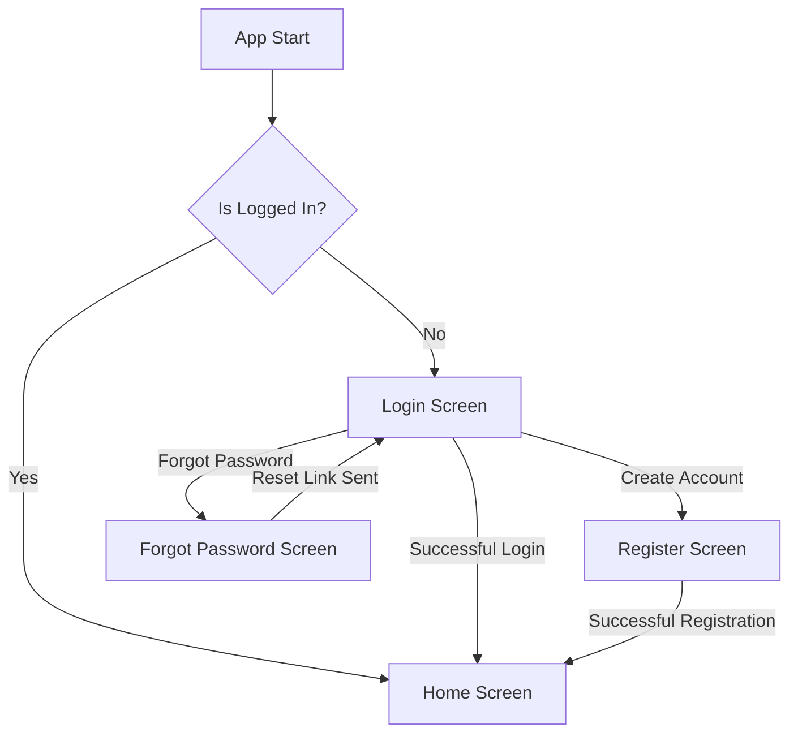
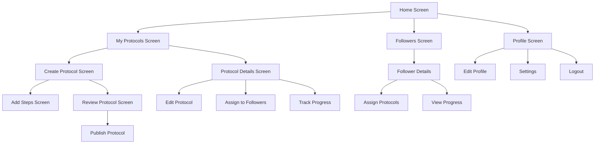
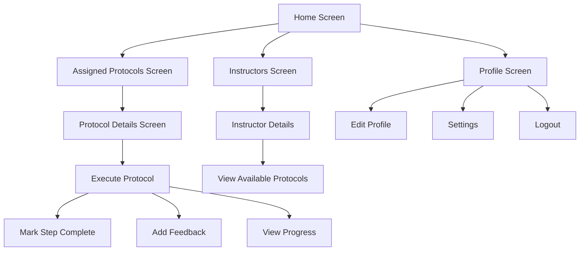
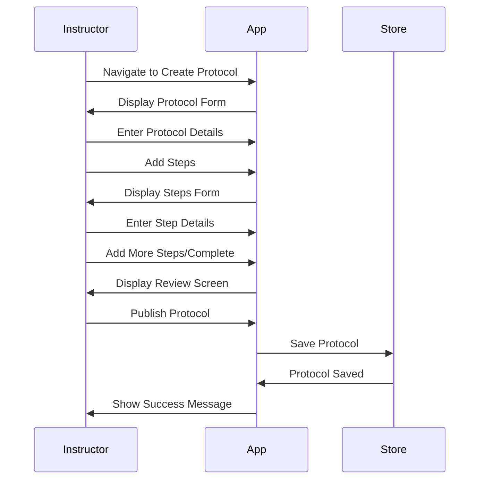
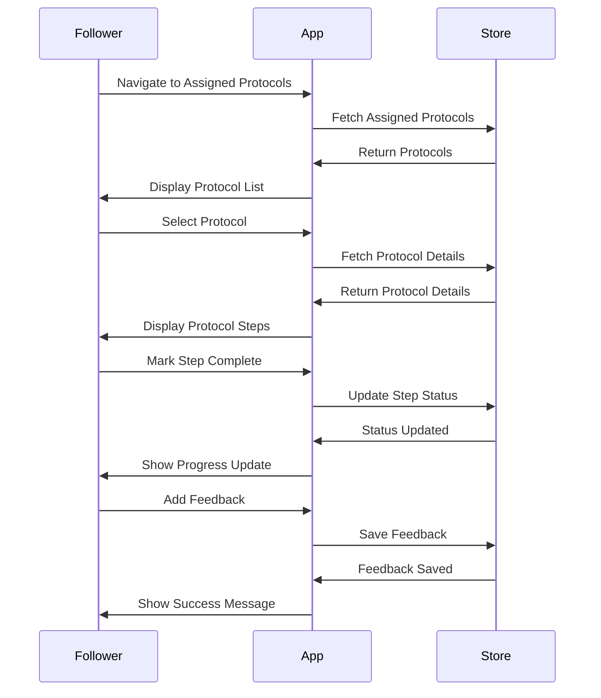
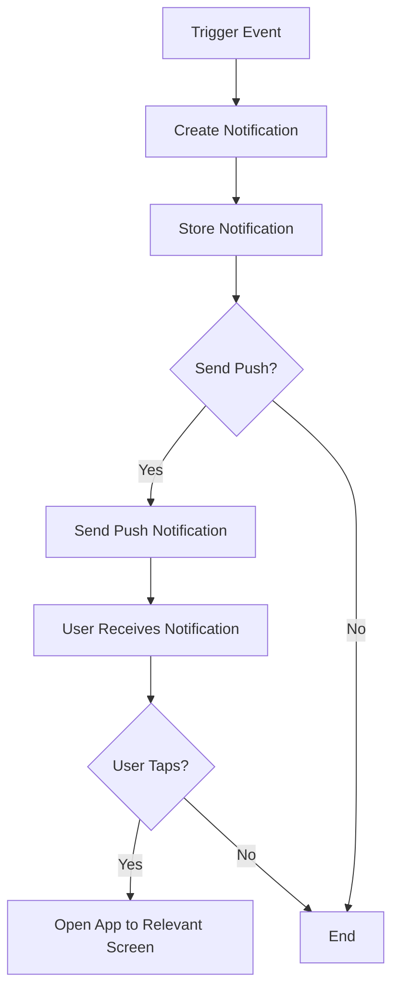
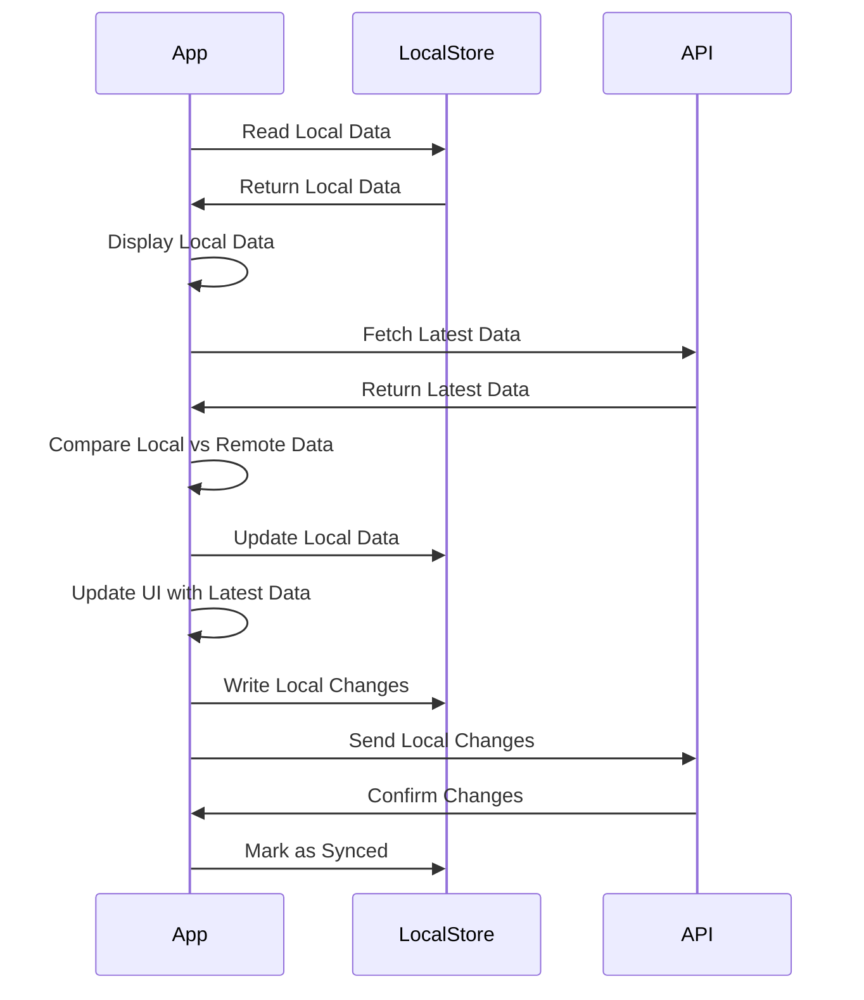

# Application Flow

This document outlines the main application flows in the Protocol Pro app.

## Authentication Flow



## Instructor Flow



## Follower Flow



## Protocol Creation Flow



## Protocol Execution Flow



## Notification Flow



## Data Synchronization Flow


```

## Step 3: Update Root Documentation

### Update Root README.md

```markdown
# Protocol Pro

Protocol Pro is a comprehensive React Native application for instructors and followers, built using a monorepo architecture.

## Project Structure

This repository contains:

- **monorepo/**: The main Protocol Pro application built with React Native, Redux, and custom UI components
- **y/**: A Turborepo starter maintained by the Turborepo core team
- **docs/**: Comprehensive documentation for the project

## Getting Started

### Prerequisites
- Node.js 18 or higher
- npm 10 or higher

### Installation

```bash
# Install dependencies
npm run install:all
```

### Running the Application

```bash
# Start the mobile app
npm run start
```

This will launch the Expo development server for the mobile application.

## Monorepo vs Y Directory

- **monorepo/**: Contains the Protocol Pro application with its specific structure and dependencies
- **y/**: Contains a Turborepo starter template that can be used as a reference or for creating new projects

## Documentation

For detailed documentation, please refer to the [docs](./docs) directory:

- [Getting Started Guide](./docs/getting-started)
- [Architecture Documentation](./docs/architecture)
- [Development Guidelines](./docs/development)
- [API Documentation](./docs/api)
- [UI Components](./docs/ui)
- [Product Requirements](./docs/product)

## License

MIT
```

### Create ARCHITECTURE.md in the Root

```markdown
# Protocol Pro Architecture

This document provides a high-level overview of the Protocol Pro architecture. For detailed architecture documentation, please refer to the [architecture documentation](./docs/architecture) directory.

## Overview

Protocol Pro is built using a monorepo architecture, which allows us to manage multiple packages and applications within a single repository.

## Key Components

- **Mobile App**: React Native Expo application
- **UI Package**: Shared UI components using ShadCN styling
- **Core Package**: Shared business logic and utilities
- **API Package**: API client and data fetching logic
- **Store Package**: Redux store, slices, and actions

## Directory Structure

```
/
├── monorepo/               # Protocol Pro monorepo
│   ├── apps/               # Applications
│   │   └── mobile/         # React Native Expo app
│   └── packages/           # Shared packages
│       ├── ui/             # UI components
│       ├── core/           # Core business logic
│       ├── api/            # API client
│       └── store/          # Redux store
└── y/                      # Turborepo starter
    ├── apps/               # Example applications
    └── packages/           # Shared packages