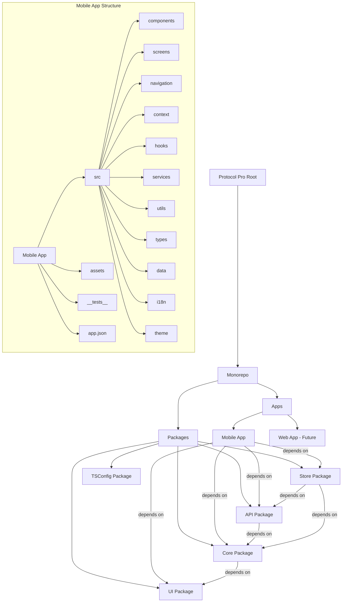
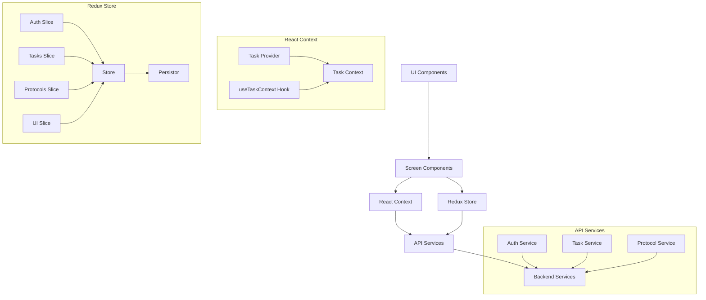
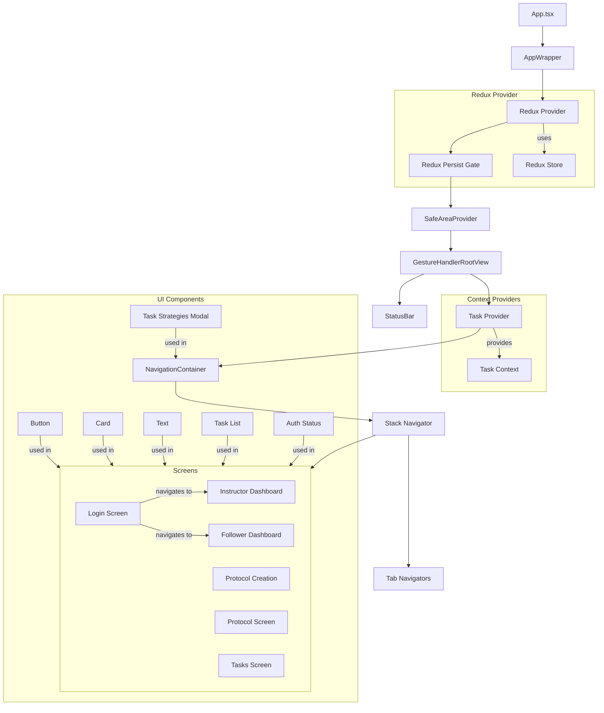
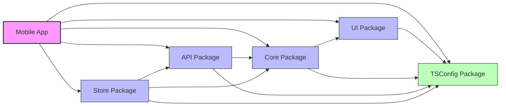
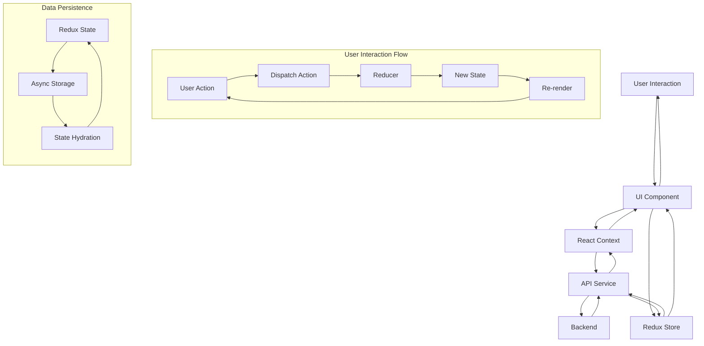
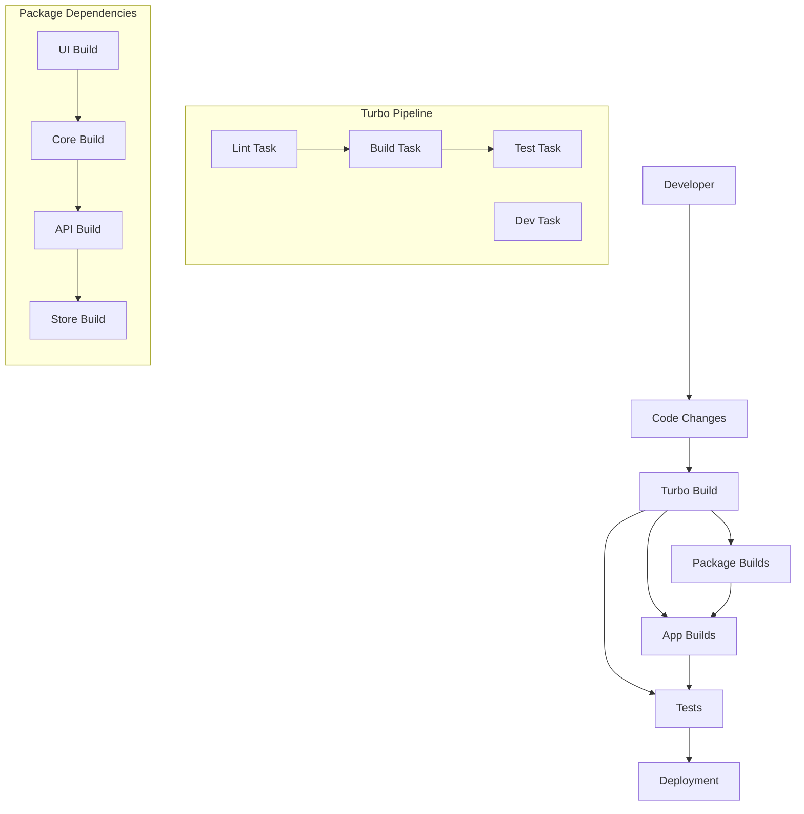
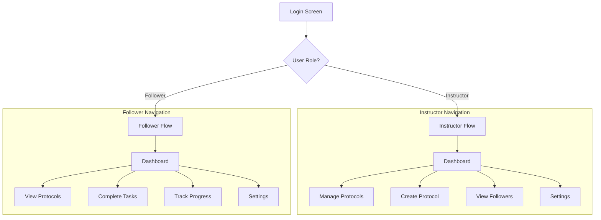
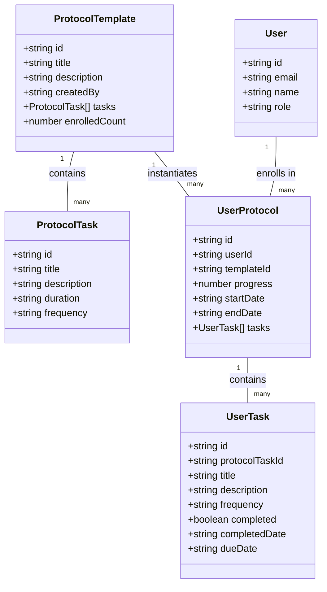

# Protocol Pro Architecture

This document provides a detailed visualization of the Protocol Pro application architecture using Mermaid diagrams.

## Monorepo Structure

## Navigation Structure

```mermaid
graph TD
    RootStack[Root Stack Navigator]
    InstructorTab[Instructor Tab Navigator]
    FollowerTab[Follower Tab Navigator]
    
    Login[Login Screen]
    Home[Home Screen]
    Details[Details Screen]
    Achievements[Achievements Screen]
    Messages[Messages Screen]
    
    InstructorDashboard[Dashboard Screen]
    Protocols[Protocols Screen]
    CreateProtocol[Create Protocol Screen]
    InstructorMessages[Messages Screen]
    InstructorSettings[Settings Screen]
    
    Protocol[Protocol Screen]
    FollowerProtocols[Protocols Screen]
    Tasks[Tasks Screen]
    Journal[Journal Screen]
    FollowerSettings[Settings Screen]
    
    RootStack --> Login
    RootStack --> InstructorTab
    RootStack --> FollowerTab
    RootStack --> Achievements
    RootStack --> Messages
    RootStack --> Home
    RootStack --> Details
    
    InstructorTab --> InstructorDashboard
    InstructorTab --> Protocols
    InstructorTab --> CreateProtocol
    InstructorTab --> InstructorMessages
    InstructorTab --> InstructorSettings
    
    FollowerTab --> Protocol
    FollowerTab --> FollowerProtocols
    FollowerTab --> Tasks
    FollowerTab --> Journal
    FollowerTab --> FollowerSettings
    
    classDef rootNav fill:#f9f,stroke:#333,stroke-width:2px
    classDef instructorNav fill:#bbf,stroke:#333,stroke-width:1px
    classDef followerNav fill:#bfb,stroke:#333,stroke-width:1px
    classDef screen fill:#fff,stroke:#333,stroke-width:1px
    
    class RootStack rootNav
    class InstructorTab,InstructorDashboard,Protocols,CreateProtocol,InstructorMessages,InstructorSettings instructorNav
    class FollowerTab,Protocol,FollowerProtocols,Tasks,Journal,FollowerSettings followerNav
    class Login,Home,Details,Achievements,Messages screen
```

## Data Flow

## Component Dependencies

## Package Dependency Graph

## State Management Flow

## Build and Development Workflow

## User Role-Based Navigation

## Protocol and Task Data Model

These diagrams provide a comprehensive visualization of the Protocol Pro application architecture, including the monorepo structure, navigation flow, data flow, component dependencies, package dependencies, state management, build workflow, user role-based navigation, and data model. 